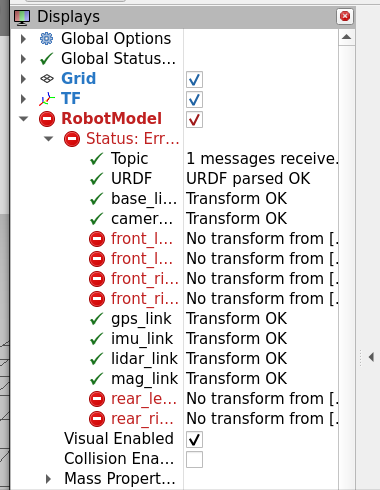
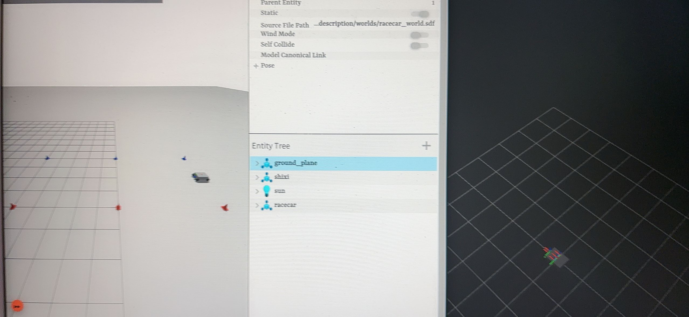

# 小组文档

## 遇到问题如何分析、解决的
- 发现车子有时候会冲出赛道，研究后发现主要原因是前瞻距离不足和控制过冲，于是主要做了以下修改
1 进行车辆模型参数修正
2 清理过期锥筒
3 高斯加权平滑路径
4 路径末端切线延伸
5 调整控制端参数
6 添加转向角低通滤波

## 组内如何讨论协作的
### 分工感知：进行slam建图，反馈速度与位置
感知（进行slam建图，反馈速度与位置等信息）：易达良，黄思翰
规划（得出平滑的路径）：肖婷
控制（实现对直角弯平滑处理后的路径的跟踪）：吴春明，胡昊梁

### 关于问题的发现与优化的讨论
Q1：好像车子有时候会跑到路线外面去————by 易达良
A1：可能主要原因还是视野不够长，最重要的应该是加了一个末端切线延生，我调了一下控制端的参数————by 易达良

Q2：这个越到后面越失控。如果转太大，他就看到身后的锥桶，就往回走了。error也要解决掉。感觉我规划部分生成的参考线太生硬了，我明天看看能不能优化。然后控制这里，之前两位同学分别是一个纯跟踪+pid方案，一个是运动学mpc方案。但是launch文件默认调。的好像是前者，明天可以换后者试一下。前面那个方案是容易推头，mpc应该好一点。————by 肖婷

A2：我看了一下，现在到mpc还跑不起来，这个当时是因为pid+纯跟踪跑得太烂才加进去的，但好像当时跑的效果也不太行————by 吴春明

Q3：感知的同学还得看一下cone_map_node这个节点。里面那些雷达点云聚类的那些代码好像都没有啥用，因为给出的sim_node已经直接发布了锥桶的位置了。现在的launch文件暂时是跳过了这个节点，没有启用。path_planning节点直接接受了带噪声的主锥桶位置。我觉得用这个节点滤一下波然后确定锥桶的位置可能会比较好。因为现在rviz里面锥桶的位置一直在抖动。————by 吴春明
A3：这我知道，不过没不影响运行，当做可选的配置接口————by 易达良

Q4：抖得好厉害啊而且我的有时候rviz没东西、车一直右转出赛道。因为锥桶很乱、而且会累积、所以那个规划的线会乱跳、给的控制就很抖————by 胡昊梁

A4：因为小车偏离规划路径太远的时候，小车转向的速度太慢。所以就把它的横向误差用来修正转向角了，现在我把转向角公式里面加的一个修正项给去掉了————by 吴春明

## 优化方向
我们在控制节点输入订阅/track_points也就是规划节点发布的参考路径、绑定在回调函数里提升读取效率、然后把路径存在ref_path变量、等待50hz的定时循环主函数入口接受、定位融合节点发布的车的坐标和速度以同样的流程和路径list一起传入横向控制lateral_controller的核心函数、将坐标投影算出横向误差、根据车速带入相关公式计算前瞻距离扫出路径上的前瞻点叠加横向误差的修正项（去掉了）从而推出转向角、用车速v、转向角δ算出Twist需要的 angular.z、同样需要判断是否到达路径终点、到达直接置零速度、同时Gazebo AckermannDrive系统插件 和 ros_gz_bridge 消息不互通控制节点到URDF里加 ROS 插件libgazebo_ros_ackermann_drive.so（能直接发Twist）控制车辆运动、并转发可视化的路径到rviz用于调试同时在交流中发现当带有横向误差修正项时、小车会乱飞、在感知的环节加入滑动均值滤波可以发布锥桶位置固定、rviz和规划接收到的锥桶就不会再乱动了、保证路径规划的稳定、从而让小车更稳定地行驶、个人在尝试相关环境依赖和配置的时候遇到非常严重的问题、起初因为变换关系不对导致感知锥桶位置呈现无规则棋盘式的分布、这直接导致蜿蜒的规划路径出现、完全无法还原赛道的真实轮廓、小车随后在赛道疯狂抖动、按照坐标校准同时增加时段均值滤波、保证map到base_link完整稳定

## ai使用情况
- 编写项目代码的大致框架、帮助编写还没有完全明白的逻辑、优化注释和README
- 复杂的数学公式来不及进行严密的数学推导就先问AI了解大概原理，如EKF的最终公式的完整推导、四元组和欧拉角的相互转换公式的完整推导
