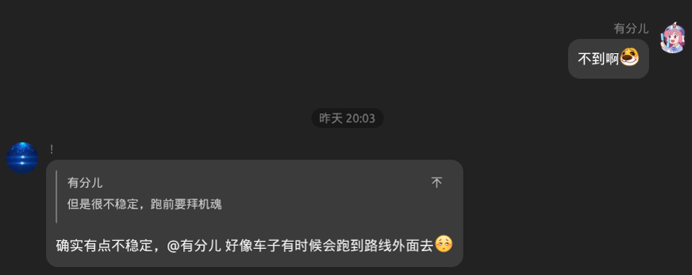
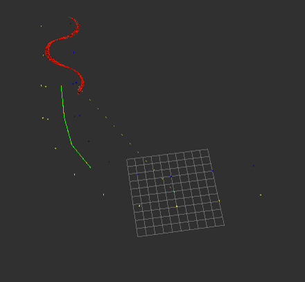

# 吴春明控制学习文档
我是吴春明，负责控制

刚想到要接手这个任务的时候，其实我连上一阶段的控制作业都没做完（

所以接到这个任务之后，我做的第一件事其实是去学习上一阶段的内容。看了控制学长发的视频，又去B站上搜了一堆控制理论的教程，边看边推公式。终于，我把那个作业做完了。刚好同时，负责感知的同学也给出了第一份代码，于是我和另一位同学就开始做我们这部分的工作。

感知的同学也给我们提供了车的初步urdf模型，搭建了初步的仿真环境。我们第一步的目标就是让车能在gazebo里面跑起来。

历史性会晤

我们决定使用后驱动前转向的结构，于是给前轮加上了转向轴和滚动轴，给后轮加上了滚动轴。接着，我们给它加了一个ackermann驱动插件，我们想在gazebo中看到自己的车跑起来，于是先写了一个基础的控制节点。它能接收nav_msgs/msg/Path, 发布gz/msgs/AckermannDrive。这时候，第一个问题出现了。我们死也没办法在gazebo中让小车收到命令。排查了半天，发现小车的俩前轮一直加载失败

.jpg

我们改了半天，又让AI看了半天，都完全没有头绪。最后，我们让AI找了个类似的项目来参考。这时我们才得知，ros-gazebo-bridge可能不支持我们发布的ackermannDriver话题。于是，我们换成了发布twist话题。这下终于能跑了

宁猜怎么着？车撞锥桶上，翻车了！？转俩圈，又翻车了！？我们的车设置的质量足足有惊人的7kg，被转圈的离心力轻易甩飞力（悲
解决完质量的问题后，我们又把小车的出生点设置到了(0,-15),方向朝北。这下仿真环境也算是搭好了。

---

于是，我们就开始写控制算法。我们决定将横向速度与纵向速度分开控制。横向速度使用纯跟踪算法，纵向速度使用PID算法控制。
对于横向速度来说，我们先选择一个前瞻距离，找到路径中最接近这个前瞻距离的那个前瞻点，然后计算车的当前位置到前瞻点的横向距离，最后通过公式来计算出所需要的转向角。
我们有了一个绝妙的想法，对前瞻距离的选择做了优化。我们使用公式`ld = max(min_lookahead, lookahead_distance + current_speed * lookahead_ratio)`实现了基于当前速度的自适应前瞻距离。小车速度越快，前瞻距离就越大，防止小车一下就冲出了轨道。

对于纵向速度的PID算法，我们的想法是，根据当前规划路径的曲率来决定当前的参考速度，路径越弯的地方，我们就降低参考速度，防止车出去。然后PID去跟踪这个参考速度。为了防止参考速度随路径曲率突变，进而导致微分项暴涨，我们使用了微分先行的思想，只对我们得到的当前速度求导。由于这是个不会突变的量，可以保证其微分有限。同时，我们还加上了积分上限，防止加速度达到最大时积分继续增长，难以下降。

正好，规划的同学也交出了规划的代码。那我们直接联合，形成一个两面包夹芝士，进行仿真。不出意外的，我们的代码跑出来了依托沟是。小车都快飞天上去了。

非常的新鲜，非常的美味
