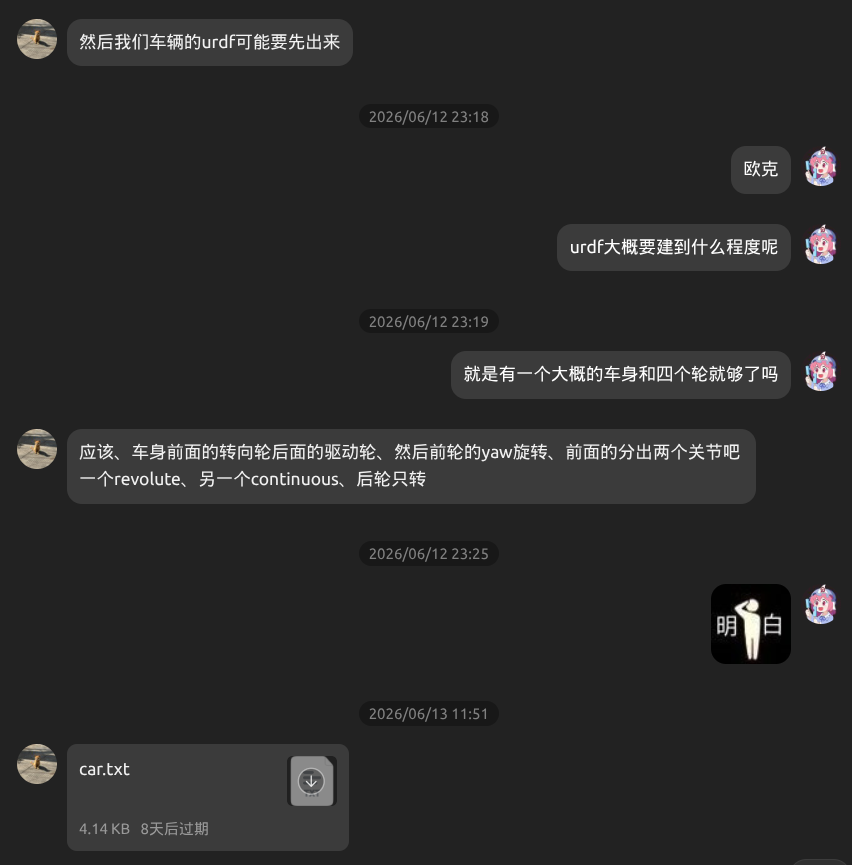

我是吴春明，负责控制

刚想到要接手这个任务的时候，其实我连上一阶段的控制作业都没做完（

所以接到这个任务之后，我做的第一件事其实是去学习上一阶段的内容。看了控制学长发的视频，又去B站上搜了一堆控制理论的教程，边看边推公式。终于，我把那个作业做完了。刚好同时，负责感知的同学也给出了第一份代码，于是我和另一位同学就开始做我们这部分的工作。

感知的同学也给我们提供了车的初步urdf模型，搭建了初步的仿真环境。我们第一步的目标就是让车能在gazebo里面跑起来。

历史性会晤

我们决定使用后驱动前转向的结构，于是给前轮加上了转向轴和滚动轴，给后轮加上了滚动轴。接着，我们给它加了一个ackermann驱动插件，我们想在gazebo中看到自己的车跑起来，于是先写了一个基础的控制节点。它能接收nav_msgs/msg/Path, 发布gz/msgs/AckermannDrive。这时候，第一个问题出现了。我们死也没办法在gazebo中让小车收到命令。排查了半天，发现小车的俩前轮一直加载失败

.jpg

我们改了半天，又让AI看了半天，都完全没有头绪。最后，我们让AI找了个类似的项目来参考。这时我们才得知，ros-gazebo-bridge可能不支持我们发布的ackermannDriver话题。于是，我们换成了发布twist话题。这下终于能跑了